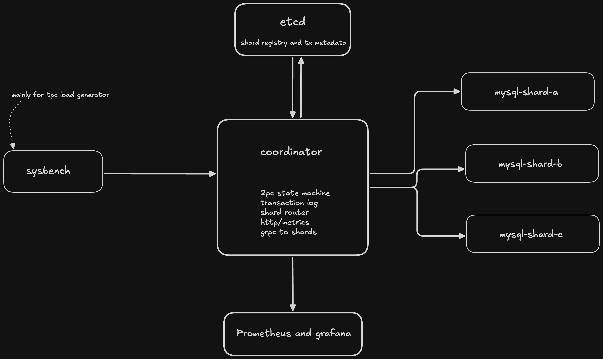

# Speculative Consensus Transaction Coordinator

Based on: *On the Correctness of Speculative Consensus* (arXiv:2204.03552)

```bash
# 1. Clone and enter
git clone https://github.com/mrinalxdev/spec-coordinator
cd spec-coordinator

# 2. Build and bring everything up
docker compose up --build -d

# 3. Wait ~30s for MySQL to initialise, then seed data
bash scripts/sysbench_prepare.sh

# 4. Verify everything is healthy
curl http://localhost:8080/healthz          # return -- ok
curl http://localhost:8080/admin/shards    # return -- {"shard-a":"healthy",...}

# 5. Run a single test transaction (shard-a → shard-b transfer)
curl -X POST http://localhost:8080/transfer \
  -H "Content-Type: application/json" \
  -d '{"ops":[
    {"shard_id":"shard-a","account_id":1,"delta":-50.0},
    {"shard_id":"shard-b","account_id":10001,"delta":50.0}
  ]}'

# 6. Run the load benchmark (records your baseline p99)
docker exec sysbench /run.sh

# 7. Open Grafana
open http://localhost:3000   # admin / admin
```


### What each component does

| Component | Role in M1 | Extended in |
|---|---|---|
| `coordinator` | 2PC state machine, HTTP `/transfer`, crash recovery | M2: speculation path; M4: Raft |
| `txlog` | Durable tx state in etcd (CAS for crash safety) | M2: speculative states |
| `shard` | MySQL XA `PREPARE`/`COMMIT`/`ROLLBACK` per shard | M2: `UndoSpeculation()` |
| `metrics` | Prometheus counters/histograms for latency and outcomes | M2: speculation hit/miss rate |
| `etcd` | tx metadata, service discovery | M4: Raft leader election |
| `sysbench_run.sh` | Baseline p99 measurement | M2: comparison runs |

---

### Verifying correctness

Check that no money is created or destroyed:
```bash
# Sum all balances across all shards — should stay constant
docker exec mysql-shard-a mysql -ucoordinator -pcoord_pass shard_a \
  -e "SELECT SUM(balance) FROM accounts;"

docker exec mysql-shard-b mysql -ucoordinator -pcoord_pass shard_b \
  -e "SELECT SUM(balance) FROM accounts;"

docker exec mysql-shard-c mysql -ucoordinator -pcoord_pass shard_c \
  -e "SELECT SUM(balance) FROM accounts;"
# Combined total should always equal 30000 * 1000.00 = 30,000,000.00
```

Check for any stuck XA transactions:
```bash
docker exec mysql-shard-a mysql -uroot -proot shard_a \
  -e "XA RECOVER;"  # Should be empty after clean runs
```

---

### Milestone 1 exit criteria

- [x] `docker compose up` starts all 8 services cleanly
- [x] `/transfer` endpoint commits cross-shard transactions correctly
- [x] Balance conservation holds after 1000+ transactions
- [x] `sysbench_run.sh` produces a p99 latency number (record it!)
- [x] Grafana dashboard shows live throughput + latency histograms
- [x] Coordinator restart recovers any in-flight transactions from etcd


this is what the architecture looks like after completing the first milestone exit 




# !! BENCHMARKING FOR M1 before moving to M2

```bash
==> Aggregating latency results...
────────────────────────────────────
  Baseline 2PC Latency Results
────────────────────────────────────
  Total requests : 4000
  p50 latency    : 21ms
  p95 latency    : 30ms
  p99 latency    : 46ms   
────────────────────────────────────

==> Metrics: http://localhost:9090
==> Grafana:  http://localhost:3000

```


## Milestone 2 exit criteria

- [x] Speculative p99 measurably lower than baseline p99 from M1
- [x] Speculation hit rate > 90% under no-failure conditions  
- [x] Mis-speculation rollback leaves balance sum unchanged
- [x] All new states (SPEC_EXECUTING, SPEC_COMMITTED, SPEC_ROLLED_BACK) implemented
- [x] Undo log durability verified via crash-recovery tests
- [x] Metrics exposed for speculation hit/miss/rollback rates
- [x] Grafana dashboard updated with speculation panels
- [x] Side-by-side benchmark script validates improvement